firstlab
981099901- Komiel Hmaih
400105252- Seyydeh Fatemeh Mousavi

**توضیح آزمایش**

ابتدا به سایت github رفته و یک repository‌ ساختیم و آن را با دستور git clone repositoryAddres کلون کردیم و سپس با دستور  git checkout -b gh-pages یک branch جدید ساختیم و روی آن branch قرار گرفتیم. با استفاده از دستور git status می‌توان متوجه شد روی کدام branch قرار داریم.

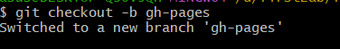

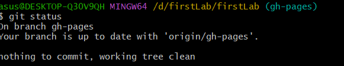

سپس با دستور . git add و در ادامه با دستور "git commit -m "your commit به کامیت کردن فایل‌ها می‌پردازیم و فایل‌های index.html, style.css, script.js را کامیت می‌کنیم و در ادامه با دستور git push‌ تغییرات را روی برنچ gh-pages پوش می‌کنیم. در ادامه برای قرار دادن سایت خود روی github actions به settings رفته و در بخش Code and automation، گزینه Pages را انتخاب می‌کنیم. سپس در قسمت Build and deployment قسمت source را روی Deploy from a branch تنظیم کرده و در قسمت branch، نام branch ای که در آن فایل‌های static ما قرار دارند را ذخیره می‌کنیم. سپس دکمه save را انتخاب کرده و کمی صبر می‌کنیم و در ادامه به آدرس https://USERNAME.github.io/repoName/ محتویات سایت ما قابل دیدن است که این آدرس برای پروژه ما به صورت https://mousavi2003.github.io/firstLab/ می‌باشد.

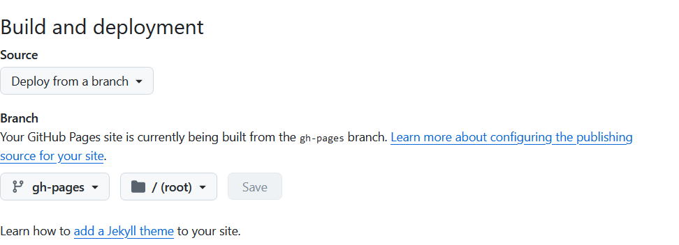

برای ساختن یک gitignore. ابتدا با دستور touch .gitignore آن را می‌سازیم و سپس داخل آن محدودیت‌های لازم را می‌گذاریم. برای مثال می‌خواهیم همه فایل‌ها با پسوند key. ایگنور شوند.در ادامه داخل gitignore. را به صورت زیر ویرایش می‌کنیم:

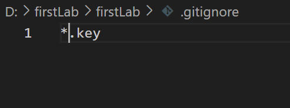

در ادامه تغییرات را add و commit کرده و push می‌کنیم. حالا اگر فایلی با پسوند key. بسازیم، می‌توانیم با استفاده از دستور git status متوجه شویم که git آن را ایگنور کرده و به آن توجهی نمی‌کند.

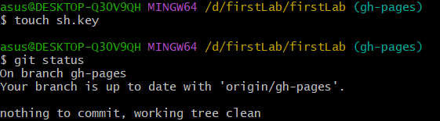

برای اضافه کردن feature ای به سایت، ابتدا به سراغ اضافه کردن برنچ feature می‌رویم. ابتدا با دستور git branch برنچ‌های موجود و برنچی که ما در آن هستیم را مشاهده می‌کنیم و سپس با دستور git branch branchName برنچ جدید را ساخته و در ادامه با دستور git switch branchName به برنچ جدید می‌رویم. 

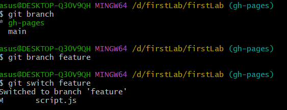

تغییرات جدید را در برنچ feature ذخیره می‌کنیم و به سراغ مرج کردن برنچ feature و gh-pages می‌رویم. برای این کار، به برنچ gh-pages رفته و در آنجا دستور git merge feature را می‌زنیم.

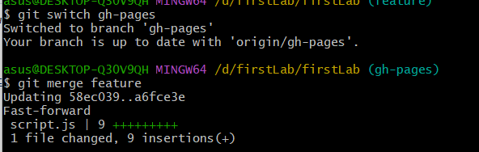

به این صورت، دو برنچ با موفقیت با یکدیگر merge‌ شدند. حالا به همین ترتیب به سراغ merge کردن برنچ main و gh-pages می‌رویم و مشابه همین دستورات را انجام می‌دهیم و به این ترتیب برنچ main ما نیز تکمیل می‌شود.

1. What is the .git directory? What information is stored in it? With which command is it created?

What is the .git Directory?
The .git directory is a hidden folder that Git creates in the root of our repository. It's the heart of the Git repository because it contains all the metadata and objects that make up the repository's history and configuration.

What Information is Stored in the .git Directory?
The .git directory contains several important subdirectories and files:

HEAD: A reference to the current branch.

Config: Configuration settings for the repository.

Description: A brief description of the repository (used by GitWeb).

Hooks: Custom scripts that can be triggered by various Git commands (e.g., pre-commit, post-commit).

Info: Additional information about the repository, such as exclude patterns.

Objects: Contains all objects, such as commits, trees, and blobs.

Refs: Contains references to commit objects, such as branches and tags.

Logs: Keeps track of the history of changes to references.

With Which Command is the .git Directory Created?
The .git directory is created when we initialize a new Git repository with the git init command.

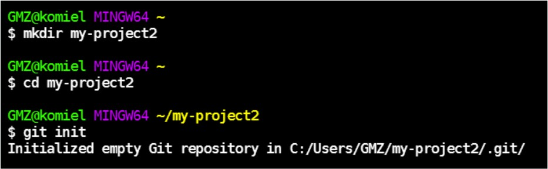

After running these commands, our new project directory will contain a .git directory. We can see it if we list all files, including hidden ones:
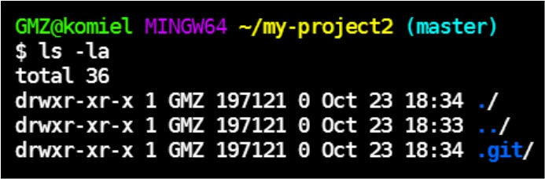

Inspecting the .git Directory:
To understand what’s inside the .git directory, we can navigate into it and list its contents:
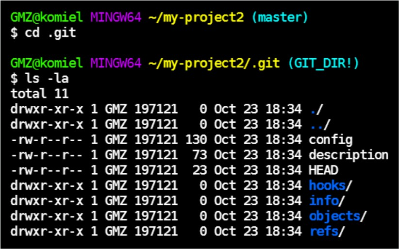

we'll see several subdirectories and files that store all the important information about our Git repository.

Using Git in Practice:
Creating a Commit: After making changes to our project, we add and commit those changes:
git add .
git commit -m "Initial commit"

This action creates new objects in the .git/objects directory, and updates references in the .git/refs directory.

Branching and Merging: Creating a new branch and switching to it:
git branch new-feature
git switch new-feature

Making changes and committing them to the new branch:
echo "Some new feature" > feature.txt
git add feature.txt
git commit -m "Add new feature"

Merging the new branch into the main branch:
git switch main
git merge new-feature

Viewing History: we can see the commit history, which is stored in the .git directory:
git log

The .git directory is the backbone of the Git repository, storing all the crucial data needed to manage the project's history and configuration. By understanding its contents and using Git commands effectively, we can maintain a robust version control system for our projects.

2. What is meant by atomic in atomic commit and atomic pull-request?

What is Meant by Atomic in Atomic Commit?

Atomic Commit: In the context of version control, an atomic commit refers to a single commit that encapsulates a complete and independent change. This means that the commit either applies entirely or not at all. The idea is to ensure that the codebase remains in a consistent state and avoids partial application of changes, which could lead to build or runtime errors.

Example: Imagine we are working on a project, and we need to add a new feature. We make several changes across multiple files to implement this feature. Instead of committing these changes in separate, fragmented commits, we bundle all the changes into a single atomic commit.
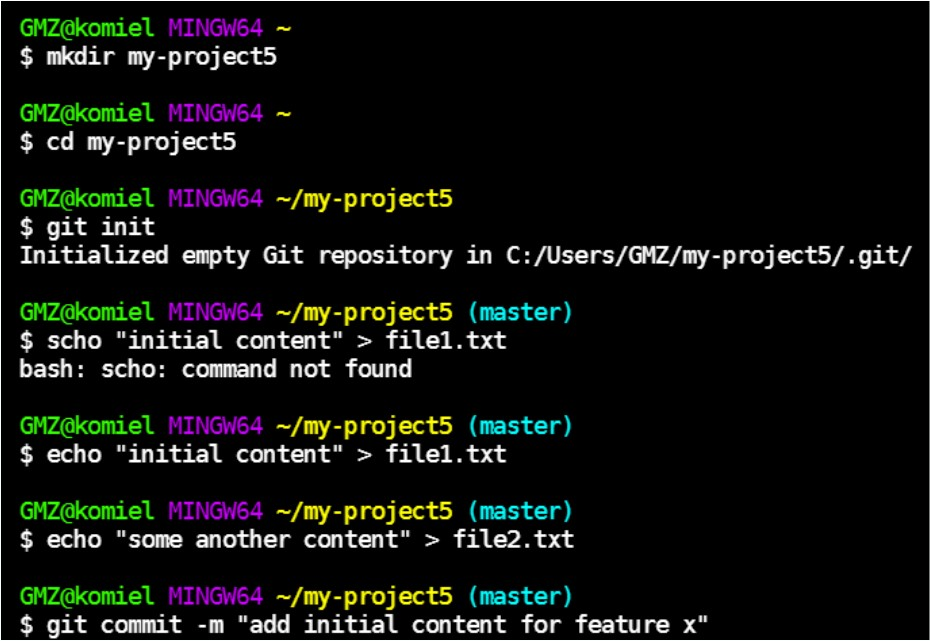

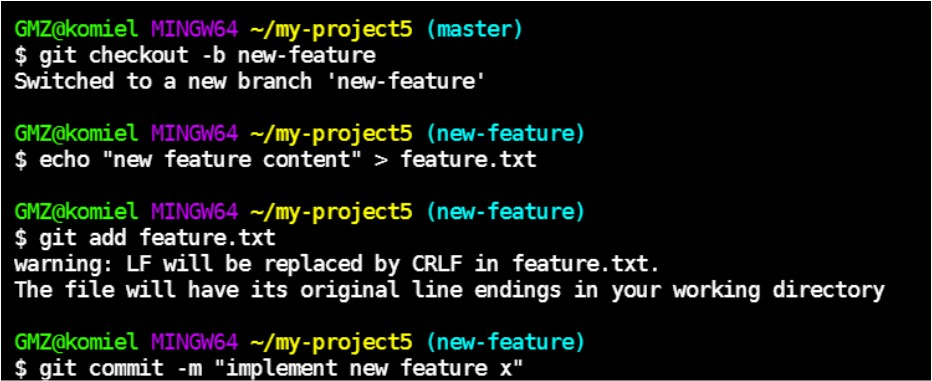

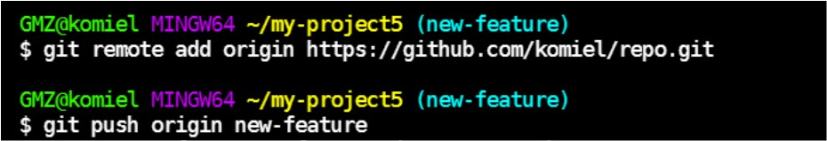

What is Meant by Atomic in Atomic Pull-Request?
Atomic Pull-Request: An atomic pull-request is a pull-request that encompasses a single logical unit of work. Just like an atomic commit, an atomic pull-request should either be merged entirely or not at all. It should not introduce partial or incomplete features into the main codebase.

Example: Suppose we have implemented a new feature in a branch and want to merge it into the main branch. We create an atomic pull-request that includes all the necessary changes for that feature.

Atomic Commit: A commit that contains a complete and independent change, ensuring the codebase remains in a consistent state.

Atomic Pull-Request: A pull-request that encompasses a single logical unit of work, ensuring that the entire set of changes is merged as a single unit.

3.Explain the difference between the commands fetch, pull, merge, rebase, and cherry-pick.

Fetch: Fetches changes from a remote repository but does not apply them to the working directory. The fetched changes are stored in the .git directory.
git fetch origin

Pull: Fetches changes from a remote repository and applies them to the working directory. It is essentially a combination of git fetch followed by git merge.
git pull origin main

Merge: Combines changes from one branch into another. Creates a merge commit if there are conflicts.
git merge feature-branch

Rebase: Reapplies commits from one branch on top of another base branch. This creates a linear history and avoids merge commits.
git rebase main

Cherry-pick: Applies a specific commit from one branch to another.
git cherry-pick <commit-hash>

4.Explain the difference between the commands reset, revert, restore, switch, and checkout.

reset: Moves the current branch to a specific commit and optionally changes the working directory and staging area.
git init my-project
cd my-project
echo "Initial content" > file.txt
git add file.txt
git commit -m "Initial commit"
echo "More content" >> file.txt
git add file.txt
git commit -m "Added more content"
git log --oneline
git reset --hard HEAD~1

revert: Creates a new commit that undoes the changes of a previous commit without altering the commit history.
git revert <commit-hash>

restore: Restores working directory files to a specific state.
git restore file.txt
git restore --source=<commit-hash> file.txt

switch: Switches branches.
git branch new-branch
git switch new-branch

checkout: Checks out a branch or specific files, updates the working directory and index.
git checkout new-branch

5.What is meant by stage or index? What does the stash command do?

What is Meant by Stage or Index?
Stage/Index: The staging area (also known as the index) is an intermediate area where changes are placed before being committed. It allows us to prepare and review changes before creating a final commit. The staging area holds a snapshot of the project's changes.

Example:

Initialize a Git repository:
mkdir my-project
cd my-project
git init

Create a new file and add content:
echo "Initial content" > file.txt

Add the file to the staging area:
git add file.txt

Check the status to see the staged file:
git status
Output:
On branch main
No commits yet
Changes to be committed:
(use "git rm --cached <file>..." to unstage)
new file: file.txt

Create a commit:
git commit -m "Add initial content to file.txt"

The file file.txt is now part of the repository's history because it was staged and committed.

What Does the stash Command Do?
stash: The git stash command temporarily shelves (or stashes) changes in the working directory that are not ready to be committed. This allows us to switch branches or perform other tasks without losing our changes. We can then reapply the stashed changes later.

Example:

Make changes to a file:
echo "More content" >> file.txt

Stash the changes:
git stash

Check the status to see that the working directory is clean:
git status

Output:
On branch main
nothing to commit, working tree clean

List the stashed changes:
git stash list

Output:
stash@{}: WIP on main: Add initial content to file.txt

Reapply the stashed changes:
git stash pop

Output:
On branch main
Changes not staged for commit:
(use "git add <file>..." to update what will be committed)
(use "git restore <file>..." to discard changes in working directory)
modified: file.txt

no changes added to commit (use "git add" and/or "git commit -a")
Dropped refs/stash@{} (abc1234...)

The changes have been reapplied to the working directory and the stash has been dropped.
Therefore:
Stage/Index: The staging area is where changes are placed before being committed, allowing us to prepare and review changes.

stash: Temporarily shelves changes in the working directory so that we can switch branches or perform other tasks without losing our changes, and allows us to reapply the changes later.

6.What is the concept of a snapshot? How is it related to a commit?

Snapshot: A record of the state of the working directory and staging area at a particular point in time.
Commit: A commit is a snapshot of the project, capturing the state of files as they are at the moment the commit is made.

What is the Concept of a Snapshot?
Snapshot: In Git, a snapshot refers to a record of the state of the working directory and staging area at a particular point in time. This snapshot captures the state of all files and directories, effectively freezing the project at that moment. Snapshots enable us to track changes over time and revert to previous states if needed.

How is a Snapshot Related to a Commit?
Commit: A commit in Git is essentially a snapshot of the project. When we commit changes, Git takes a snapshot of the files as they are at that moment and stores a reference to that snapshot. Each commit represents a unique state of the project at a specific point in time.

7.What are the differences between a local repository and a remote repository?

Differences Between Local Repository and Remote Repository

1.Local Repository: A local repository exists on our local machine. It contains the full history of all changes made to the project. We can commit, branch, merge, and perform other Git operations locally.

2.Remote Repository: A remote repository is hosted on a server and shared among multiple developers. It serves as the central repository where we push our changes and fetch updates from others. Remote repositories facilitate collaboration and version control across a team.
